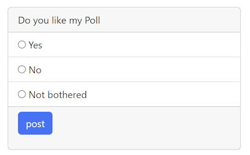

# Our.Community.Polls
Simple Poll Property Editor for Umbraco

## Update 2.0.3
Adds a new ViewComponent template to allow ajax post when voting

## Update 2.0.2
Adds dictionary strings for Q & A etc.
You will need to create Dictionary items which match the values used when creating the Poll, these can then be translated when rendered.

## Documentation

* [Developers Guide](developers-guide.md)

* [Gallery](gallery.md)
